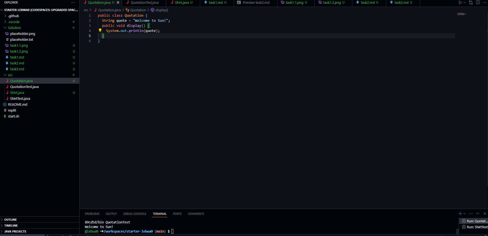
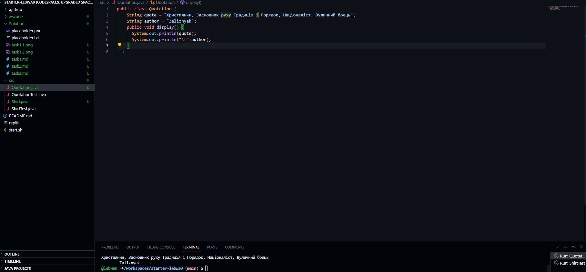

```java
public class Quotation {
    String quote = "Християнин, Засновник руху Традиція і Порядок, Націоналіст, Вуличний боєць";
    String author = "Zaliznyak";
    public void display() {
      System.out.println(quote);
      System.out.println("\t"+author);
    }
  }
```